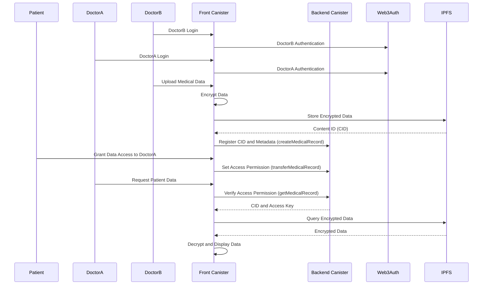

# Mutual Link

<div align="center">
  <p><strong>A Decentralized Platform for Medical Data Sovereignty and Efficient Healthcare Services</strong></p>
</div>

## Project Overview

Mutual Link is transforming the medical referral system through a decentralized platform built on the Internet Computer Protocol (ICP). The system enables individuals to regain control over their medical data and experience improved healthcare services. Our vision is to create a data-driven referral system that fosters efficient and transparent communication between patients and healthcare providers.

### Technical Motivation

The implementation of ICP is essential for meeting availability and confidentiality requirements while handling sensitive medical data in compliance with personal information protection laws. After evaluating various blockchain and distributed storage solutions, ICP was selected for its:

- **Subnet Architecture**: Provides high scalability and fault tolerance with dedicated subnet replication across multiple data centers
- **On-chain Asset Delivery**: Eliminates reliance on traditional CDNs through certified canister state and boundary nodes
- **Web Integration**: Seamless connectivity with existing web infrastructure via HTTP outcalls and canister-based frontend delivery

### ICP Technical Advantages

- **Deterministic Execution Environment**: Guarantees consistent computation results across all replicas, essential for medical data integrity
- **Orthogonal Persistence**: Automatic state persistence without traditional databases, reducing development complexity and attack surface
- **Query/Update Call Separation**: Optimizes performance with non-consensus reads and consensus-based writes
- **Canister Gas Model**: Predictable computation costs with cycles instead of variable gas fees
- **Certified Variables**: Cryptographically verifiable canister state without trusting the boundary node

## Architecture

### Data Flow



### Backend Canisters

The current system is built using the following canister architecture:

1. **Main Canister**

   This single backend canister consists of two major internal modules:

   - **Doctor Management Module**

     - Handles doctor registration, verification, and credentials
     - Manages public key infrastructure
     - Indexes searchable doctor profiles
     - Efficient lookup based on hashmap
     - Verifies credentials through digital signatures

   - **Medical Record Management Module**
     - Implements access control for medical records
     - Verifies data integrity using SHA-256 hashing
     - Maintains immutable record transfer history
     - Implements time-based access control with automatic expiration
     - Uses BTree structures for efficient record searching

2. **Frontend Asset Canister**
   - Delivers web assets directly from the Internet Computer
   - Implements security content policies
   - Verifies boundary nodes
   - Streams large assets
   - Optimizes client-side caching

### Inter-Canister Communication

- **Inter-module Communication**: Efficient communication through direct function calls between doctor management and medical record management modules within the main canister
- **Frontend-Backend Communication**: Type safety guaranteed through Candid interface
- **Error Handling**: Implementation of error handling patterns based on Result type
- **Response Optimization**: Efficient pagination and response structuring for query and update calls

### Data Encryption Flow

Medical records follow a secure encryption process:

1. Data is encrypted client-side using AES-256-GCM with authenticated encryption
2. The AES key is encrypted using the recipient's public RSA-2048 key
3. Encrypted data is stored on IPFS with CIDs recorded on-chain in certified variables
4. Access control is managed through canister smart contracts with principal-based verification
5. Data transfer occurs without exposing unencrypted content to intermediaries
6. Non-deterministic initialization vectors (IV) ensure encryption uniqueness
7. Digital signatures verify data authenticity and integrity

## Technology Stack

- **Frontend**: Next.js, TypeScript, React Query (state management)
- **Backend**: Internet Computer Protocol (ICP), Motoko
- **Smart Contracts**: Motoko with actor-based concurrency model and stable memory
- **Security**: Web3Auth, RSA+AES hybrid encryption
- **Storage**: Certified on-chain state with IPFS integration
- **Canister Design**: Actor model with message-passing concurrency
- **API Interface**: Candid IDL for cross-language type safety
- **State Management**: Orthogonal persistence with stable variables

## Performance Optimization Strategies

- **Query Caching**: Implementing caching for frequently accessed data to reduce redundant computation
- **Incremental Updates**: Using delta-based updates instead of full state transfers
- **Pagination Patterns**: Implementing cursor-based pagination for large data sets
- **Computation Batching**: Grouping related operations to minimize consensus rounds
- **Stable Storage Layout**: Optimizing storage patterns for efficient upgrades
- **Cycle Optimization**: Implementing cycle-efficient algorithms to reduce computation costs

## Project Structure

```
mutual-link/
├── src/
│   ├── mutual-link-backend/      # Motoko backend code
│   │   ├── main.mo               # Main entry point
│   │   ├── DoctorManagement.mo   # Doctor management module
│   │   └── MedicalRecordManagement.mo # Medical record management module
│   ├── mutual-link-frontend/     # Frontend assets
│   │   ├── src/
│   │   │   ├── components/       # Reusable UI components
│   │   │   ├── pages/            # Page components
│   │   │   ├── services/         # API service integrations
│   │   │   ├── hooks/            # Custom React hooks
│   │   │   └── utils/            # Helper utilities
│   │   ├── public/               # Static assets
│   │   └── dist/                 # Build output
│   └── declarations/             # Auto-generated interfaces
├── dfx.json                      # DFX configuration file
└── package.json                  # Project dependencies
```

## Technical Implementation Roadmap

### Milestone 1: Web3Auth Integration and User Registration Canister (1 month)

- Implement Web3Auth integration authentication canister
- Develop persistent user registration data structures with stable memory
- Initialize frontend asset canister with content security policies
- Implement cross-canister calls between authentication and profile systems

### Milestone 2: Role-Based Access Control (RBAC) Canister (1 month)

- Design permission hierarchy using principal-based access control
- Implement role management canister with upgrade mechanisms
- Develop administrator verification with secure authentication
- Implement security guard patterns for method access control

### Milestone 3: Integration Testing and System Launch (1 month)

- Develop integration test suite with Motoko test library
- Implement end-to-end testing with simulated user flows
- Performance optimization for canister cycles efficiency
- Final canister deployment with secure upgrade strategy

## Development Setup

### Prerequisites

- Node.js 16 or later
- DFX 0.13.1 or later
- Internet Computer SDK

### Local Development

```bash
# Install dependencies
npm install

# Start the replica in the background
dfx start --background

# Deploy canisters to the replica and generate candid interface
dfx deploy
```

Once deployed, your application will be available at `http://localhost:4943?canisterId={asset_canister_id}`.

### Generating Interface Definitions

After modifying backend canisters, generate updated type definitions:

```bash
npm run generate
```

### Frontend Development Server

```bash
npm start
```

This starts a server at `http://localhost:8080`, proxying API requests to the replica at port 4943.

## License

This project is licensed under the [MIT License](LICENSE).
